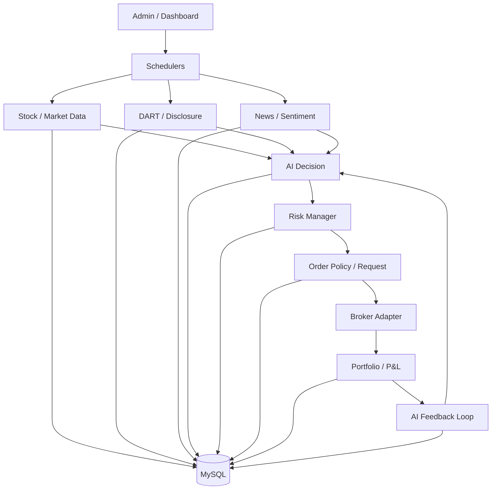
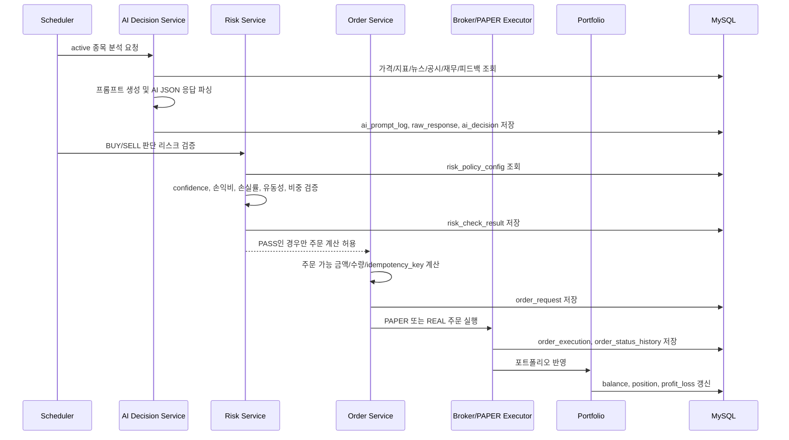

# CPM: AI 기반 주식 판단/자동매매 백엔드

CPM(Copy Paste Money)은 주식 데이터를 수집하고, AI가 매매 판단을 생성한 뒤, 룰 기반 리스크 검증과 주문 정책을 통과한 경우에만 PAPER 또는 REAL 모드로 주문 흐름을 진행하는 백엔드 프로젝트입니다.

이 프로젝트의 핵심은 "AI가 매수하라고 했으니 바로 주문한다"가 아닙니다. AI는 판단을 만들고, 시스템은 그 판단을 검증하고, 모든 과정은 DB에 기록됩니다. 즉, AI를 자동매매 시스템 안에서 통제 가능한 의사결정 모듈로 다루는 것이 목표입니다.

## 왜 만들었나

주식 자동매매를 만들 때 가장 위험한 지점은 모델의 답변을 그대로 실행하는 것입니다. 그래서 이 프로젝트는 처음부터 다음 원칙으로 설계했습니다.

- AI는 판단한다.
- Risk Manager가 검증한다.
- Order Policy Engine이 주문 수량과 금액을 계산한다.
- Broker Adapter가 주문 실행을 담당한다.
- 판단, 리스크 결과, 주문 요청, 체결, 손익, 피드백은 모두 저장한다.

이 구조를 통해 AI 판단을 "블랙박스 추천"이 아니라 재현 가능하고 검토 가능한 데이터 흐름으로 바꾸는 것을 목표로 했습니다.

## AI를 어떻게 사용했나

이 프로젝트는 AI를 단순 코드 생성 도구로 사용하지 않고, 개발 프로세스의 일부로 통제했습니다.

1. 요구사항을 먼저 자연어로 정의하고, 구현 전에 `plan/` 문서로 작업 범위와 영향도를 남겼습니다.
2. AI에게 "무엇을 만들지"뿐 아니라 "무엇을 하면 안 되는지"를 명확히 줬습니다. 예를 들어 DB 스키마 임의 변경 금지, 민감정보 하드코딩 금지, PAPER/REAL 테이블 분리 같은 제약을 문서화했습니다.
3. 큰 기능은 한 번에 만들지 않고, 데이터 수집, AI 판단, 리스크 검증, 주문 생성, 체결 동기화, 피드백 저장으로 나누어 구현했습니다.
4. AI가 생성한 코드는 로그, DB 상태, 테스트, 실제 API 응답을 기준으로 다시 검증했습니다.
5. 장애나 이상 동작이 생기면 "왜 안 됐는지"를 먼저 추적했습니다. 예를 들어 AI 판단은 BUY인데 주문이 안 된 경우, confidence, risk policy, 유동성, 손익비, 주문 수량 계산을 순서대로 확인하는 방식으로 디버깅했습니다.

제가 중요하게 본 것은 AI에게 정답을 요구하는 것이 아니라, AI가 실수할 수 있다는 전제 위에서 계획, 제약, 기록, 검증 루프를 만드는 것이었습니다.

## 전체 구조

## AI 판단에서 주문까지

## 주요 기능

- active 종목 기반 데이터 수집 및 부트스트랩
- 일봉/분봉/현재가/수급/기술적 지표 저장
- DART 공시와 재무 데이터 수집 및 요약
- 뉴스 수집, AI 요약, 감성 분석
- AI 매매 판단 생성 및 원문 응답 저장
- confidence, 손익비, 예상 손실률, 유동성, 포트폴리오 비중 기반 리스크 검증
- PAPER 모드 가상 잔고, 가상 포트폴리오, 가상 체결 처리
- REAL 모드 계좌/포지션 동기화와 주문 흐름 분리
- 목표가/손절가 기반 보유 종목 모니터링
- 일간/주간/월간 피드백 저장
- 운영 상태를 확인하는 대시보드

## AI 모델 설정

모델은 코드에 고정하지 않고 환경변수로 바꿀 수 있게 구성했습니다.

| 목적 | 설정 키 | 기본값 |
| --- | --- | --- |
| 종목 매매 판단 | `OPENAI_MODEL_DECISION` | `gpt-5.4` |
| 뉴스/공시 요약 | `OPENAI_MODEL_SUMMARY` | `gpt-4.1-mini` |
| 고신뢰 후보 재검토 | `OPENAI_MODEL_REVIEW` | `gpt-5.4` |

## 리스크 게이트

AI의 BUY 판단은 주문 조건이 아니라 주문 후보입니다. 실제 주문 전에는 다음 검증을 통과해야 합니다.

- AI confidence가 정책 기준 이상인가
- 목표가가 현재가보다 높고 손절가가 현재가보다 낮은가
- 손익비가 최소 기준 이상인가
- 예상 손실률이 과도하지 않은가
- 계좌 예수금과 종목별 최대 비중을 넘지 않는가
- 유동성이 부족하지 않은가
- 최소 주문 수량이 가능한가
- 같은 판단으로 중복 주문이 생성되지 않는가

이 결과는 `risk_check_result`에 저장되며, 실패한 판단은 주문으로 이어지지 않습니다.

## PAPER와 REAL 모드

실제 계좌와 가상 계좌는 테이블부터 분리했습니다.

| 구분 | 계좌 | 포지션 | 손익 |
| --- | --- | --- | --- |
| PAPER | `paper_account_balance` | `paper_portfolio_position` | `paper_portfolio_profit_loss` |
| REAL | `account_balance` | `portfolio_position` | `portfolio_profit_loss` |

이렇게 분리한 이유는 실험 중인 AI 전략이 실제 계좌 상태를 오염시키지 않도록 하기 위해서입니다. 같은 주문 흐름을 사용하되, 실행 대상과 저장 위치를 모드별로 분리했습니다.

## 기술 스택

- Java 21
- Spring Boot 3.5.x
- MyBatis
- MySQL 8
- WebClient
- Spring Scheduler
- Lombok
- Gradle
- Vanilla HTML/CSS/JavaScript Dashboard

## 결과 화면
### 대시보드

## 구현하면서 중요하게 본 점

- 자동매매보다 먼저 관측 가능성을 만들었습니다. AI 프롬프트, 원문 응답, 파싱 결과, 리스크 결과, 주문 상태, 외부 API 호출 로그를 DB에 남겼습니다.
- AI 판단과 주문 실행 사이에 의도적으로 여러 게이트를 두었습니다.
- 단순히 "BUY가 많다"가 아니라 "왜 BUY가 주문으로 이어지지 않았는지"를 추적할 수 있게 만들었습니다.
- 대시보드는 예쁜 화면보다 현재 계좌, 포지션, AI 판단, 리스크 실패, 주문 이력, 스케줄러 상태를 빠르게 확인하는 운영 도구로 설계했습니다.
- Public repository를 고려해 민감정보는 환경변수 또는 `application-local.yml`로 분리했습니다.

## 배운 점

AI를 개발에 잘 쓰는 방법은 "AI가 코드를 많이 쓰게 하는 것"이 아니라, AI가 일할 수 있는 경계와 검증 기준을 명확히 주는 것이었습니다.

이 프로젝트에서는 AI에게 구현을 요청하기 전에 목표, 금지사항, DB 계약, 실패 조건을 먼저 설명했고, 구현 후에는 로그와 DB 결과로 다시 검증했습니다. 그 결과 AI를 단순 자동완성 도구가 아니라 설계, 구현, 디버깅을 함께 진행하는 협업 도구로 사용할 수 있었습니다.
